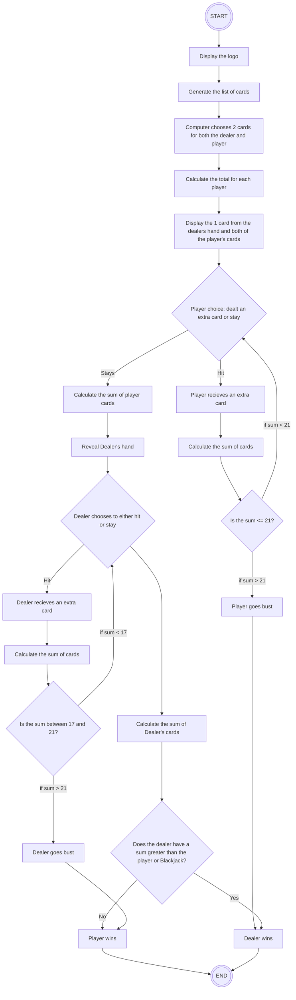

# blackjack
Blackjack Game 

## Key Objectives

## The Results

## The Process

```mermaid
flowchart TD
    start(((START)))
    logo[Display the logo]
    generate[Generate the list of cards]
    choice[Computer chooses 2 cards for both the dealer and player]
    calculate[Calculate the total for each player]
    display[Display the 1 card from the dealers hand and both of the player's cards]
    player_choice{Player choice: dealt an extra card or stay}
    player_deal1[Player recieves an extra card]
    player_deal2[Calculate the sum of cards]
    player_check{Is the sum <= 21?}
    calculate2[Calculate the sum of player cards]
    reveal[Reveal Dealer's hand]
    dealer_choice{Dealer chooses to either hit or stay}
    dealer_deal1[Dealer recieves an extra card]
    calculate3[Calculate the sum of cards]
    dealer_check{Is the sum between 17 and 21?}
    dealer_bust[Dealer goes bust]
    player_bust[Player goes bust]
    dealer_wins[Dealer wins]
    player_wins[Player wins]
    calculate4[Calculate the sum of Dealer's cards]
    dealer_check2{Does the dealer have a sum greater than the player or Blackjack?}
    finish(((END)))
    start --> logo
    logo --> generate
    generate --> choice
    choice --> calculate
    calculate --> display
    display --> player_choice
    player_choice -->|Hit| player_deal1
    player_deal1 --> player_deal2
    player_deal2 --> player_check
    player_check -->|if sum < 21|player_choice
    player_check -->|if sum > 21|player_bust
    player_bust --> dealer_wins
    player_choice -->|Stays| calculate2
    calculate2 --> reveal
    reveal --> dealer_choice
    dealer_choice -->|Hit|dealer_deal1
    dealer_deal1 --> calculate3
    calculate3 --> dealer_check
    dealer_check -->|if sum < 17|dealer_choice
    dealer_choice --> calculate4
    calculate4 --> dealer_check2
    dealer_check2 -->|No|player_wins
    dealer_check2 -->|Yes|dealer_wins
    dealer_check -->|if sum > 21|dealer_bust
    dealer_bust --> player_wins
    player_wins --> finish
    dealer_wins --> finish
```
